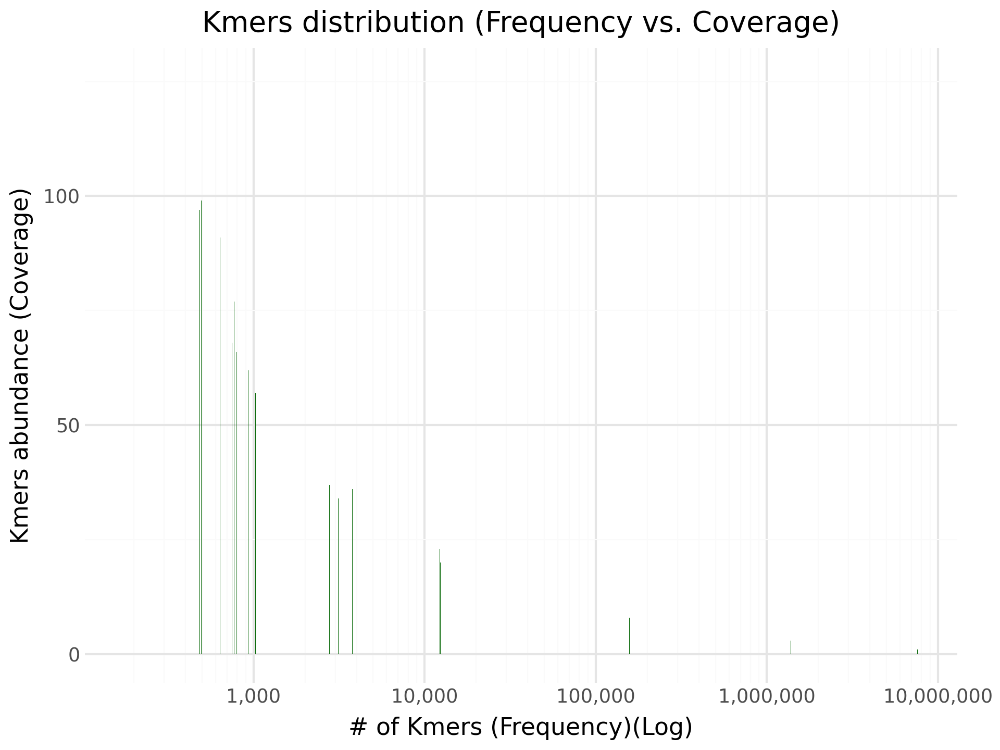
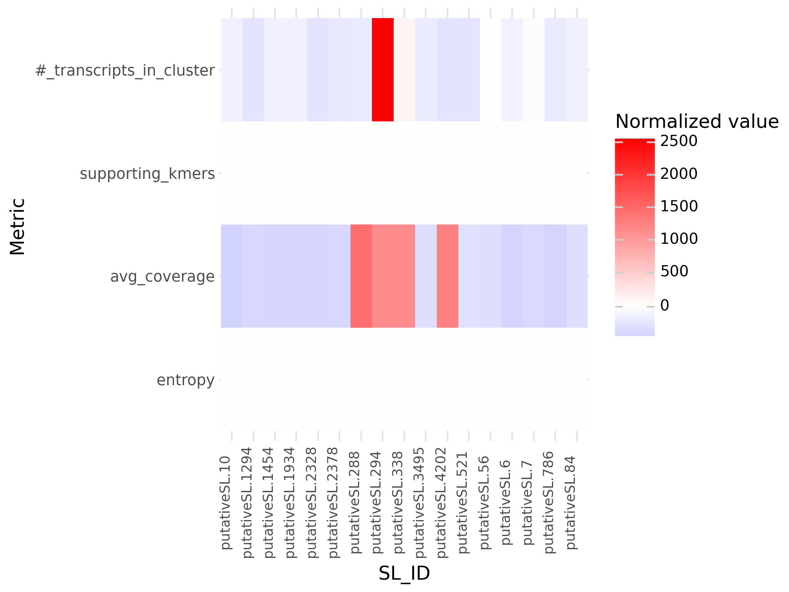
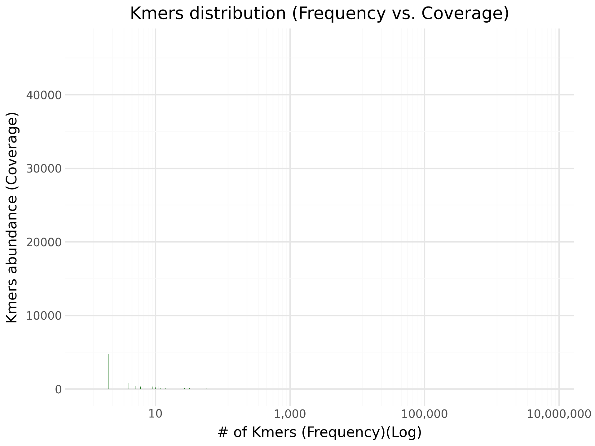
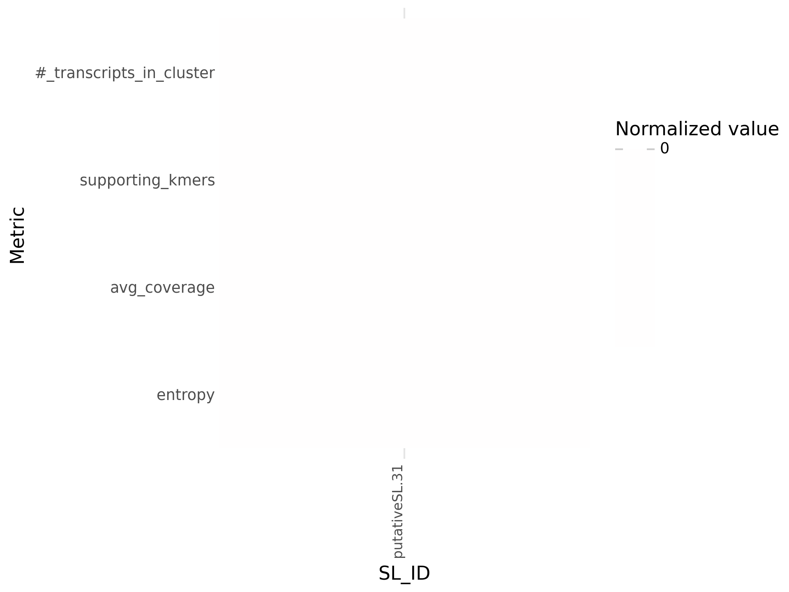
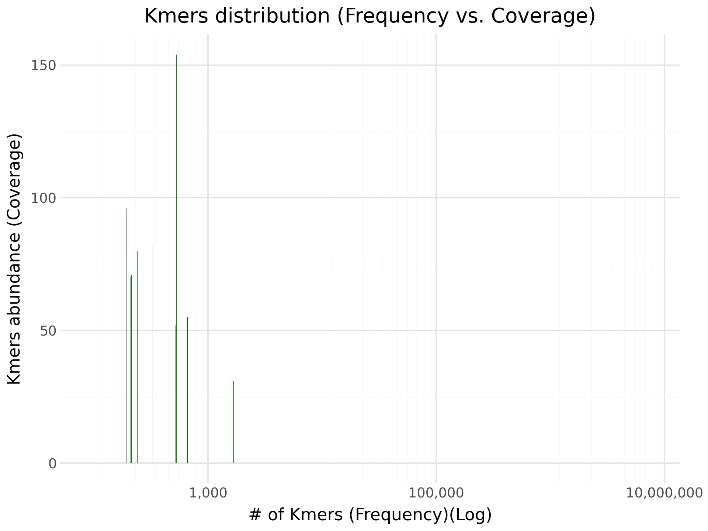

# SL discovery

[](https://www.nextflow.io/)
[](https://sylabs.io/docs/)

## 🚀 Introduction
**SLseek** is a bioinformatics pipeline for discovering highly represented sequences at the ends of transcripts, usually spliced leader (SL) sequences in organisms with trans-splicing. It analyses full-length transcriptomic data using a k-mer-based approach, avoiding costly steps such as mapping or transcriptome assembly, and does not require a reference genome. 

This pipeline is built using [Nextflow](https://www.nextflow.io), a scalable workflow management tool. 

## 🔁 Pipeline summary

1. Extract ends of transcripts from the input full-length transcripts;
2. Count kmers using either [FastK](https://github.com/thegenemyers/FASTK) and/or [Jellyfish](https://github.com/gmarcais/Jellyfish);
3. Get Putative SL sequences (e.g, sequences composed of kmers highly present at the ends of transcripts, within a specified size and mostly non-repetitive);
4. Cluster Putative SLs using [CD-HIT](https://github.com/weizhongli/cdhit).

Optionally, the pipeline can generate a k-mer histogram and a heatmap plot with putative SL assessment metrics. 


---


## ⚙️ Usage

> [!NOTE]
> Please refer to [this page](https://nf-co.re/docs/usage/installation) to install and set-up Nextflow. You can test the installation following [this link](https://nf-co.re/docs/usage/introduction#how-to-run-a-pipeline) with `-profile test`.

```bash
nextflow run transsplicing.nf -profile [standard | lsf [ ,singularity ]] \
    --outdir <path/to/outdir/> \
    --transcripts <path/to/transcripts.fasta> \
    --kmer_counting_tool (fastk | jellyfish) \
    -c [transsplicing.config] \
    [ -resume ]
```
---

## 📖 Understanding parameters 
| Parameter | Default | Required | Description | Options/Input Type |
| :--- | :--- | :--- | :--- | :--- |
| `outdir` | | **Yes** | A path to where saving outputs. | `string` |
| `transcripts` |  | **Yes** | A fasta file with full-length transcripts | `string` |
| `length` | `100` | **No**  | Length of extracted sequences for analysis - Should encompass SL size. | `int` |
| `k` | `21` | **No** | K-mer size for analysis - Should be less than SL-size and typically an odd number. | `int` |
| `lower_cov_thrsld_counting` | `150` | **No** | Minimum coverage of kmers to filter using Jellyfish or FastK | `int` |
| `lower_cov_thrsld_extracting` | `150` | **No** | Minimum coverage of kmers to filter in k-mer analysis steps | `int` |
| `max_distance` | `3`  | **No** | Minimum distance to consider a K-mer within the same group | `int` |
| `extra_border` | `0` | **No** | Number of extranucleotides flanking putative SLs from K-mers. | `int` |
| `size_limit_max` | `30` | **No** | Maximum size of a Putative SL. | `int` |
| `size_limit_min` | `20` | **No** | Miiumum size of a Putative SL. | `int` |
| `entropy_lim` | `1.40` | **No** | Minumum entropy value for Putative SL to avoid repetitive sequences | `float` |
| `nucleotide_limit` | **0.7** | **No** | Percentage of nucleotides to consider a kmer as uninformative. E.g., for 0.7, kmers with 70% of the same nucleotides will be removed | `float` |
| `identity_thrsld` | `0.90` | **No** | Identity threshold for CD-HIT Putative SL clustering. | `float` |
| `heatmap` | `false` | **No** | If called or true, will generate a heatmap plot with putative SL analysis metrics | `boolean` (E.g., true; false) |
| `kmerplot` | `false` | **No** | If called or true, will generate a kmer histogram with kmer counting process | `boolean` (E.g., true; false) |
| `kmer_counting_tool` | `jellyfish`  | **Yes** | kmer counting tool | `string` (E.g., jellyfish or fastk)|

---

## 📦 Using the SLseek Singularity Container

The SLseek workflow can use a Singularity image for easy reproducibility. You can pull it from the [Sylabs Cloud](https://cloud.sylabs.io/) library and run it directly. 

### 1. Pull the container

```bash
singularity pull library://beatriz-estevam/bio/slseek:1.0.0
```

This will download `slseek.sif` to your current directory. SLseek expects it in the [`containers` directory](https://github.com/sanger-tol/SLseek/tree/main/containers). 

### 2. Use at least the `--profile singularity` to run the pipeline with it 

```bash
nextflow run transsplicing.nf -c transsplicing.config -profile singularity
```

---


## 🧪 Test data

A  set of data to test is provided within the project repository to help users quickly verify the installation and functionality of the pipeline. You can find all relevant files in the dedicated `test/` directory of this repository. 

### Running tests 

! Assuming you are in the root directory of the pipeline


```bash
nextflow run transsplicing.nf \
        -c transsplicing.config
        --transcripts test/celegans_slidr_transcripts.fa \
        --k 17 \
        --outdir "test/results/" \
        --kmer_counting_tool "fastk" \
        --heatmap --kmerplot \
        -profile lsf, singularity \
        -resume 
```

**RESULTS**

| Kmer plot | heatmap |
|----------|----------|
|  |  | 

| SL_ID          | putative_sequence                       | entropy           | avg_coverage      | supporting_kmers | #_transcripts_in_cluster |
|----------------|----------------------------------------|-----------------|-----------------|-----------------|--------------------------|
| putativeSL.56  | CGGCAATTTGCCGATTTGCCGGAAATTTTC        | 1.97248976687495 | 295.8           | 15              | 258                      |
| putativeSL.84  | CGGAATTGAAAATTTCCGGCAAATCGGCAA        | 1.94939785333961 | 285.266666666667| 15              | 116                      |
| putativeSL.294 | CATTTTCTCAAACTTGGGTAATTAAACCCC        | 1.89010748014126 | 1777.5          | 14              | 2825                     |
| putativeSL.521 | AATTGAAAATTTCCGGCAAATCGGCAAATT        | 1.89892956369094 | 300.666666666667| 15              | 5                        |
| putativeSL.786 | GGAATGGAATGGAATGGAATGGAATGGAAT        | 1.52192809488736 | 188.6           | 15              | 53                       |
| putativeSL.1454| AAATTGCCGGAATTGAAAATTTCCGGCAAA        | 1.91387559754782 | 217.2           | 15              | 110                      |
| putativeSL.1934| GCAAATCGGCAAATTGCCGGAATTGAAAAT        | 1.91387559754782 | 204.142857142857| 14              | 119                      |
| putativeSL.2378| TCAATTCCGGCAATTTGCCGATTTGCCGGA        | 1.98387111321815 | 231.357142857143| 14              | 40                       |
| putativeSL.3495| GAAAATTTCCGGCAAATCGGCAAACCGGCA        | 1.9167161869614  | 288.75          | 12              | 68                       |
| putativeSL.1294| CGATTTGCCGGAAATTTTCAATTCCGGCA         | 1.9841165493995  | 229.5           | 14              | 1                        |
| putativeSL.338 | TTACCTCAAACTTGGGTAATTAAACCCT          | 1.89788985125302 | 1768.23076923077| 13              | 367                      |
| putativeSL.2328| CGGAAATTTTCAATTCCGGCAATTTGCC          | 1.97014297933532 | 211.230769230769| 13              | 5                        |
| putativeSL.4202| GAGGGTTTAATTACCCAAGTTTGAGAAT          | 1.89788985125302 | 1893.53846153846| 13              | 2                        |
| putativeSL.288 | CATCTCAAACTTGGGTAATTAAACCT            | 1.9006709673922  | 2069.81818181818| 11              | 52                       |
| putativeSL.7   | CGGTTTGATCTACAAAAAATGCGGG             | 1.95740581142552 | 245.3           | 10              | 244                      |
| putativeSL.10  | CATATTTGACGCGCAAAATATC                 | 1.9196905740497  | 162.666666666667| 6               | 113                      |
| putativeSL.6   | GGACCACCAGGACCACCAGG                    | 1.57095059445467 | 185.2           | 5               | 143                      |


```bash
nextflow run transsplicing.nf \
        -c transsplicing.config
        --transcripts test/celegans_slidr_transcripts.fa \
        --lower_cov_thrsld_counting 500 \
        --k 17 \
        --outdir "test/results/" \
        --kmer_counting_tool "jellyfish" \
        --heatmap --kmerplot \
        -profile lsf, singularity \
        -resume 
```

| Kmer plot | heatmap |
|----------|----------|
|  |  | 

| SL_ID          | putative_sequence              | entropy           | avg_coverage | supporting_kmers | #_transcripts_in_cluster |
|----------------|-------------------------------|-----------------|-------------|-----------------|--------------------------|
| putativeSL.31  | GGGGTTTAATTACCCAAGTTTGAGA     | 1.92154193333593 | 2376.1      | 10              | 3174                     |


```bash
nextflow run transsplicing.nf \
        -c transsplicing.config
        --transcripts test/celegans_slidr_transcripts.fa \
        --lower_cov_thrsld_counting 500 \
        --k 21 \
        --outdir "test/results/" \
        --kmer_counting_tool "fastk" \
        --heatmap --kmerplot \
        -profile lsf, singularity \
        -resume 
```

| Kmer plot | heatmap |
|----------|----------|
|  |  | 

| SL_ID          | putative_sequence              | entropy           | avg_coverage       | supporting_kmers | #_transcripts_in_cluster |
|----------------|-------------------------------|-----------------|------------------|-----------------|--------------------------|
| putativeSL.31  | GGGGTTTAATTACCCAAGTTTGAGA     | 1.92154193333593 | 1760.83333333333 | 6               | 3174                     |


